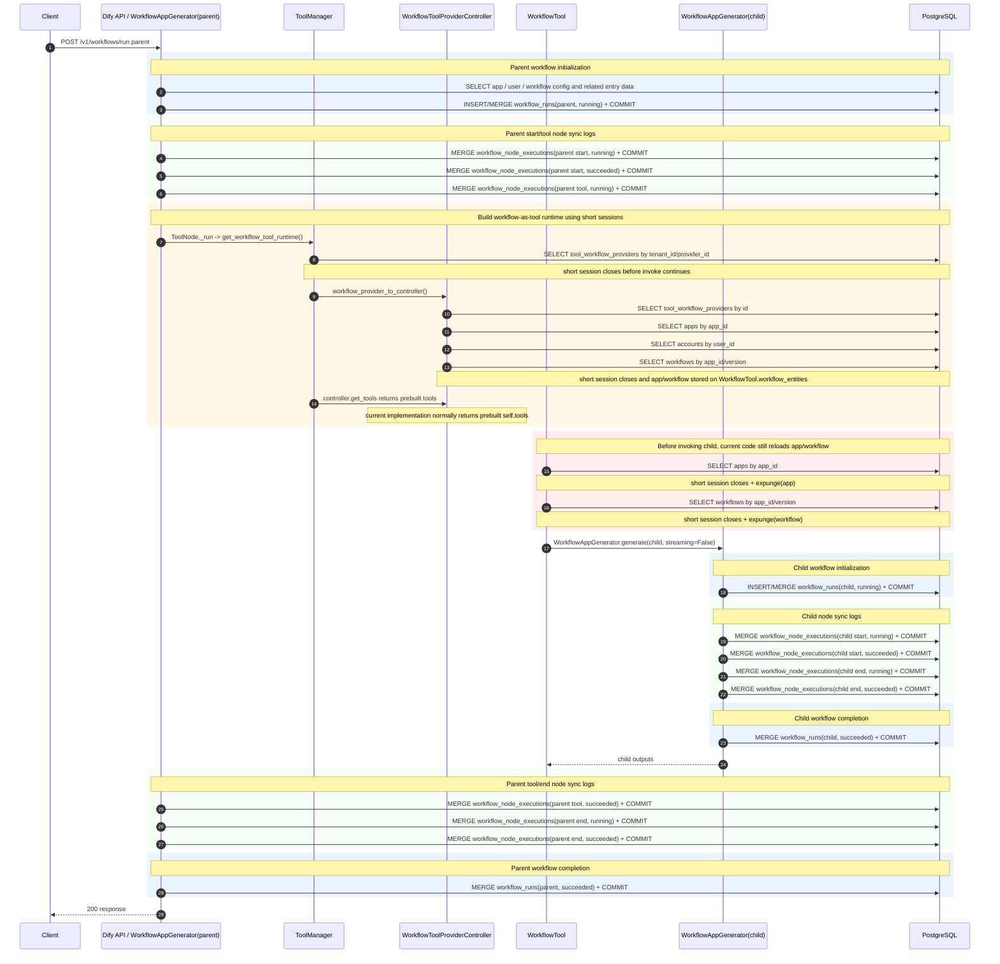
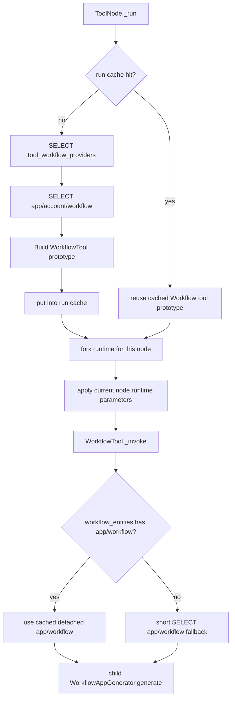

# Nested Workflow Sync DB Calls

## Scope

This note describes the **current synchronous workflow-node-log scenario** for one nested workflow run:

```text
parent workflow -> workflow-as-tool node -> child workflow
```

Assumptions:

- Node execution logs are written synchronously to DB, not published to ActiveMQ.
- `workflow_runs` are always written synchronously.
- The current branch already contains the short-session workflow-as-tool DB session lifetime fix.
- The diagram focuses on core workflow execution DB calls and excludes optional trace/provider/node-specific business queries unless noted.

## High-Level Sequence



## Calls by Category

### 1. Parent Workflow Writes

For a minimal parent workflow shaped like:

```text
start -> workflow-tool -> end
```

core sync writes are approximately:

```text
workflow_runs:
  parent running      1 write
  parent succeeded    1 write

workflow_node_executions:
  start running       1 write
  start succeeded     1 write
  tool running        1 write
  tool succeeded      1 write
  end running         1 write
  end succeeded       1 write
```

Parent subtotal:

```text
2 workflow_runs writes
6 workflow_node_executions writes
```

### 2. Child Workflow Writes

For a minimal child workflow shaped like:

```text
start -> end
```

core sync writes are approximately:

```text
workflow_runs:
  child running       1 write
  child succeeded     1 write

workflow_node_executions:
  start running       1 write
  start succeeded     1 write
  end running         1 write
  end succeeded       1 write
```

Child subtotal:

```text
2 workflow_runs writes
4 workflow_node_executions writes
```

### 3. Workflow-as-Tool Metadata Queries

Current repaired sync path still does several short-lived metadata queries per workflow-as-tool invocation:

```text
ToolManager.get_tool_runtime(... WORKFLOW ...):
  SELECT tool_workflow_providers by tenant_id/provider_id

WorkflowToolProviderController.from_db(...):
  SELECT tool_workflow_providers by id
  SELECT apps by app_id
  SELECT accounts by user_id
  SELECT workflows by app_id/version

WorkflowTool._invoke(...):
  SELECT apps by app_id
  SELECT workflows by app_id/version
```

Metadata subtotal:

```text
~7 SELECTs per workflow-as-tool invocation
```

These sessions are intentionally short-lived after the latest fix, so they should not hold transactions open across child workflow execution. However, they still add round-trip latency and can become visible under high concurrency.

## Rough Core DB Round-Trip Count

For one minimal nested sync run:

```text
metadata SELECTs:                  ~7
workflow_runs writes:               4
workflow_node_executions writes:    10
--------------------------------------
core workflow DB round-trips:       ~21+
```

This estimate excludes:

- API token/authentication lookup.
- Initial app/workflow loading outside the core runtime diagram.
- Trace/OPS queries.
- Node-specific queries, for example knowledge retrieval.
- Consumer writes, because this document is sync-only.

## Why the Session Fix Can Be Slower

The recent short-session fix changes the failure mode:

```text
Before:
  fewer apparent query sites, but global db.session could hold idle transactions while child workflow runs

After:
  short sessions close promptly, but metadata lookups are still repeated as separate DB round-trips
```

This explains why pressure tests can show:

- fewer/no `idle in transaction | SELECT tool_workflow_providers...` connections,
- no QueuePool timeout,
- but higher average and p50/p95 latency.

The fix improves connection lifetime safety. It does not yet optimize repeated workflow-as-tool metadata lookup.

## Optimization Target

The most obvious duplicate metadata calls are:

```text
ToolManager SELECT tool_workflow_providers
WorkflowToolProviderController.from_db SELECT tool_workflow_providers again
WorkflowToolProviderController.from_db SELECT app/workflow
WorkflowTool._invoke SELECT app/workflow again
```

A run-level cache can preserve short-session safety while reducing repeated metadata lookup.

## Run-Level Cache Shape



Expected cache behavior:

```text
First workflow-as-tool call in one parent workflow run:
  perform metadata SELECTs, build WorkflowTool prototype, store in run cache

Subsequent calls to the same workflow tool in the same parent workflow run:
  reuse cached prototype, fork a fresh runtime, apply current node parameters
```

This should reduce repeated metadata reads while keeping these constraints:

- No process-global stale cache.
- No cross-run sharing.
- No caching of user inputs or child outputs.
- Runtime parameters must be recomputed per node invocation.
- Existing short-session close-before-child-generate behavior must remain.

## Expected Impact

The sync write cost remains:

```text
workflow_runs writes
workflow_node_executions writes
```

The optimization only targets workflow-as-tool metadata SELECTs.

For repeated calls to the same child workflow inside one parent run, the per-additional-call metadata overhead can drop from approximately:

```text
~7 SELECTs
```

toward:

```text
0 or near-0 metadata SELECTs
```

For a parent workflow with only one workflow-as-tool call, a smaller optimization is still available by making `WorkflowTool._invoke()` use the already-populated `workflow_entities["app"]` and `workflow_entities["workflow"]` instead of reloading them.
